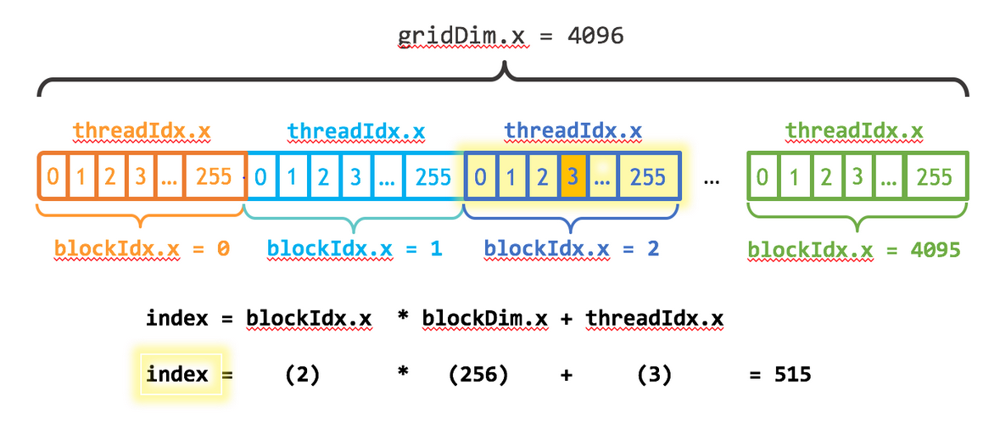

# 001从最简单的cuda程序开始

ref:https://developer.nvidia.com/blog/even-easier-introduction-cuda/

## 核心概念

内存分配与拷贝
```c++
  // Allocate Unified Memory -- accessible from CPU or GPU
  float *x, *y;
  cudaMallocManaged(&x, N*sizeof(float));
  cudaMallocManaged(&y, N*sizeof(float));

  ...

  // Free memory
  cudaFree(x);
  cudaFree(y);
```

调用kernel
```c++
int blockSize = 256;
int numBlocks = (N + blockSize - 1) / blockSize;
add<<<numBlocks, blockSize>>>(N, x, y);
```

计算索引(将二维索引空间转换为线性空间的标准算法)
```c++
__global__
void add(int n, float *x, float *y)
{
  int index = blockIdx.x * blockDim.x + threadIdx.x;
  int stride = blockDim.x * gridDim.x;
  for (int i = index; i < n; i += stride)
    y[i] = x[i] + y[i];
}
```



## Summing up

| Version | Laptop (GeForce RTX 1050) | 双4090 |
|----------|----------|----------|
| 1 CUDA Thread    | 938.79ms   | 631ms |
| 1 CUDA Block    | 5.0735ms   | 7ms |
| Many CUDA Blocks    | 0.499ms  | 769us |
| Many CUDA Blocks(仅使用命令行nvcc编译)    | 0.213ms   | 0.403ms |
| Many CUDA Blocks(Generate GPU Debug Information - 否)    | 0.223ms   | 0.403ms |


TODO: 为什么仅使用命令行nvcc编译耗时比使用Visual Studio短呢？
答：因为Visual Studio 2022默认开启了“Generate GPU Debug Information”，右键项目，点击属性-CUDA C/C++ - Device - Generate GPU Debug Information - 选择否。

另外Code Generation填写自己的gpu最适合的算力，[算力查询](https://developer.nvidia.com/cuda-gpus),经查询，我的1050的算力为6.1，所以“Code Generation”栏填写compute_61,sm_61（不过实测好像这个没什么影响）

## Exercises

2、Experiment with printf() inside the kernel. Try printing out the values of threadIdx.xand blockIdx.x for some or all of the threads. Do they print in sequential order? Why or why not?
```c++
__global__
void add(int n, float* x, float* y)
{
    int index = blockIdx.x * blockDim.x + threadIdx.x;
    int stride = blockDim.x * gridDim.x;
    for (int i = index; i < n; i += stride)
    {
        y[i] = x[i] + y[i];
        printf("Thread %d in Block %d has index %d\n", threadIdx.x, blockIdx.x, index);
        }
    }
        
}
```

在这个修改后的版本中，内核函数add()现在还会打印出每个线程的索引和所在的块索引。由于GPU的并行性质，这些打印信息会以非顺序的方式出现，这展示了并行执行的本质。此外，使用cudaDeviceSynchronize()确保所有的GPU操作都完成后才继续CPU上的操作，这对于确保所有的printf()输出都能在程序结束前显示是必要的。

3、Print the value of threadIdx.y or threadIdx.z (or blockIdx.y) in the kernel. (Likewise for blockDim and gridDim). Why do these exist? How do you get them to take on values other than 0 (1 for the dims)?

在CUDA编程模型中，threadIdx.x, threadIdx.y, threadIdx.z, blockIdx.x, blockIdx.y, blockIdx.z, blockDim.x, blockDim.y, blockDim.z, gridDim.x, gridDim.y, 和 gridDim.z 这些变量被用来标识和管理多维的线程格和块。其中，threadIdx 表示线程在块内的索引，blockIdx 表示块在网格中的索引，blockDim 表示块的维度大小，gridDim 表示网格的维度大小。

这些多维的索引存在的原因是为了更好地映射和管理复杂的数据结构，例如矩阵、图像处理等。使用多维索引可以使得内存访问模式更加高效，更符合实际应用的数据结构布局。

**如何让这些维度的值非0或非1：**

    默认情况下，如果你没有明确指定一个维度，那么blockDim和gridDim的y和z维度将会是1，threadIdx和blockIdx的y和z将会是0。

    要让这些值取非0（对于索引）或非1（对于维度），你需要在核函数调用时明确指定多维的块尺寸或网格尺寸。


