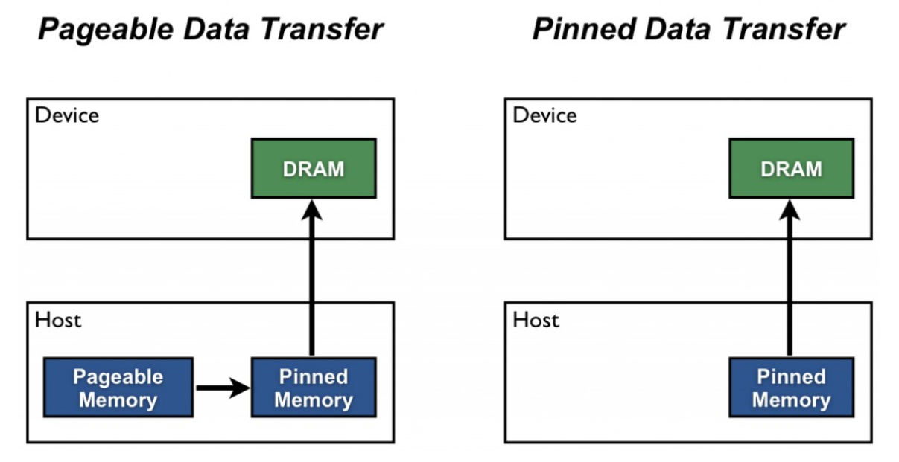
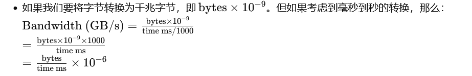

# How to Optimize Data Transfers in CUDA C/C++

## 从主机设备数据传输的一些一般准则

- 尽可能减少主机和设备之间传输的数据量，即使这意味着在 GPU 上运行内核与在主机 CPU 上运行相比几乎没有加速或没有加速。
- 使用页面锁定（或“固定”）内存时，主机和设备之间可以实现更高的带宽。
- 将许多小传输批量合并到一个较大的传输中效果会更好，因为它消除了大部分每次传输的开销。
- 主机和设备之间的数据传输有时可能与内核执行和其他数据传输重叠。

我们在这篇文章中研究了上面的前三个准则，我们将在下一篇文章中讨论重叠数据传输。

## 使用 nvprof 测量数据传输时间

为了测量每次数据传输所花费的时间，我们可以在每次传输之前和之后记录一个 CUDA 事件并使用 cudaEventElapsedTime()，正如我们 在上一篇文章中 所描述的。 但是，我们可以使用 CUDA 工具包（从 CUDA 5 开始）附带的命令行 CUDA 分析器 nvprof 来获取经过的传输时间，而无需使用 CUDA 事件检测源代码。 让我们尝试一下以下代码示例，您可以在 本文的 Github 存储库 中找到该示例。 

Tips:cudaMalloc和cudaMallocManaged有什么区别

cudaMalloc 和 cudaMallocManaged 是用于NVIDIA CUDA 平台内存分配的两种不同函数，它们在如何管理内存和访问数据方面有所不同。

    cudaMalloc:
        cudaMalloc 用于在GPU的设备内存上分配内存。当使用 cudaMalloc 分配内存时，该内存空间仅可由GPU访问，CPU不能直接访问这部分内存。
        开发者需要显式地使用 cudaMemcpy 来在主机内存和GPU内存之间传输数据。

    cudaMallocManaged:
        cudaMallocManaged 则用于分配统一内存（Unified Memory），这种内存既可以由CPU访问，也可以由GPU访问。使用这种内存模型时，CUDA运行时负责处理内存迁移，使得开发者可以不用显式地进行数据传输。
        这大大简化了编程模型，因为它允许CPU和GPU共享相同的数据指针，而不需要担心数据在不同内存空间之间的移动。

总结来说，cudaMalloc 提供了对GPU内存的精细控制，适用于需要高性能优化的场景。而 cudaMallocManaged 通过简化内存管理，可以帮助开发者更容易编写出CPU和GPU共用数据的程序，但可能在某些情况下会牺牲一些性能。

```c++
int main()
{
    const unsigned int N = 1048576;
    const unsigned int bytes = N * sizeof(int);
    int *h_a = (int*)malloc(bytes);
    int *d_a;
    cudaMalloc((int**)&d_a, bytes);

    memset(h_a, 0, bytes);
    cudaMemcpy(d_a, h_a, bytes, cudaMemcpyHostToDevice);
    cudaMemcpy(h_a, d_a, bytes, cudaMemcpyDeviceToHost);

    return 0;
}
```

```
$ nvcc profile.cu -o profile_test
$ nvprof ./profile_test
```

当我在配备 GeForce GTX 1050的台式电脑上运行时，我得到以下输出。

```
PS D:\cuirongpei\01_Code\cuda_learn_VS2022\Samples\0_Introduction\004DataTransfer> nvprof .\profile_test.exe
==17584== NVPROF is profiling process 17584, command: .\profile_test.exe
==17584== Profiling application: .\profile_test.exe
==17584== Profiling result:
            Type  Time(%)      Time     Calls       Avg       Min       Max  Name
 GPU activities:   51.60%  1.0219ms         1  1.0219ms  1.0219ms  1.0219ms  [CUDA memcpy DtoH]
                   48.40%  958.62us         1  958.62us  958.62us  958.62us  [CUDA memcpy HtoD]
 ```

如你看到的， nvprof测量每个 CUDA memcpy 调用所花费的时间。 它报告每次调用的平均时间、最短时间和最大时间（因为我们只运行每个副本一次，所以所有时间都是相同的）。 nvprof非常灵活，因此请务必 [查看文档](https://docs.nvidia.com/cuda/profiler-users-guide/index.html#nvprof-overview) 。

nvprof是 CUDA 5 中的新增功能。如果您使用的是 CUDA 的早期版本，则可以使用较旧的“命令行分析器”，正如 Greg Ruetsch 在他的文章[《 如何优化 CUDA Fortran 中的数据传输》](https://developer.nvidia.com/blog/parallelforall/how-optimize-data-transfers-cuda-fortran/) 中所解释的那样。 


## 最大限度地减少数据传输

我们不应该仅使用内核的 GPU 执行时间相对于其 CPU 实现的执行时间来决定是运行 GPU 还是 CPU 版本。 我们还需要考虑通过 PCI-e 总线移动数据的成本，尤其是当我们最初将代码移植到 CUDA 时。 由于 CUDA 的异构编程模型同时使用 CPU 和 GPU，因此可以一次将代码移植到 CUDA 一个内核。 在移植的初始阶段，数据传输可能会主导整个执行时间。 值得密切关注数据传输所花费的时间与内核执行所花费的时间。 正如我们已经演示的那样，使用命令行分析器很容易做到这一点。 随着我们移植更多代码，我们将删除中间传输并相应地减少总体执行时间。

## 固定主机内存

默认情况下，主机 (CPU) 数据分配是可分页的。 GPU 无法直接从可分页主机内存访问数据，因此当调用从可分页主机内存到设备内存的数据传输时，CUDA 驱动程序必须首先分配一个临时页面锁定或“固定”主机数组，复制主机数据到固定阵列，然后将数据从固定阵列传输到设备内存，如下所示。



如图所示，固定内存用作从设备到主机传输的暂存区域。 我们可以通过直接在固定内存中分配主机阵列来避免可分页和固定主机阵列之间的传输成本。

在 CUDA C/C++ 中分配固定主机内存[使用cudaMallocHost()](https://docs.nvidia.com/cuda/cuda-runtime-api/index.html#group__CUDART__MEMORY_1g9f93d9600f4504e0d637ceb43c91ebad) 或 [cudaHostAlloc()](https://docs.nvidia.com/cuda/cuda-runtime-api/index.html#group__CUDART__MEMORY_1g15a3871f15f8c38f5b7190946845758c) 取消分配 ，并使用[cudaFreeHost()](https://docs.nvidia.com/cuda/cuda-runtime-api/index.html#group__CUDART__MEMORY_1gedaeb2708ad3f74d5b417ee1874ec84a) 。 固定内存分配可能会失败，因此您应该始终检查错误。 以下代码摘录演示了通过错误检查分配固定内存。

```c++
cudaError_t status = cudaMallocHost((void**)&h_aPinned, bytes);
if (status != cudaSuccess)
  printf("Error allocating pinned host memory\n");
```

Tips:

在CUDA编程中，cudaMallocHost()、cudaHostAlloc()和cudaFreeHost()是用于管理主机（CPU）内存的函数，特别是那些需要与GPU交互的内存。这些函数有助于优化CPU与GPU之间的数据传输速度。

    cudaMallocHost():
        cudaMallocHost() 函数用于在主机上分配页锁定内存（也称为钉住内存或非交换内存）。页锁定内存可以防止操作系统将内存页交换到磁盘，这是实现高速CPU与GPU数据传输的关键。
        页锁定内存通过直接内存访问（DMA）允许GPU直接访问CPU内存，从而加快数据传输速度。
        该函数的调用形式通常为：cudaMallocHost(void **ptr, size_t size)，其中 ptr 是指向分配内存的指针的指针，size 是要分配的字节数。

    cudaHostAlloc():
        cudaHostAlloc() 提供了更多的灵活性，除了分配页锁定内存外，还可以指定额外的标志来控制内存的行为。例如，可以设置内存为可写时传递（Write-Combined，WC），这对于某些类型的数据传输可能更有效。
        典型的调用形式为：cudaHostAlloc(void **ptr, size_t size, unsigned int flags)，flags 参数可以用于指定额外的内存属性，如 cudaHostAllocWriteCombined。

    cudaFreeHost():
        cudaFreeHost() 用于释放由 cudaMallocHost() 或 cudaHostAlloc() 分配的内存。
        正确释放页锁定内存是非常重要的，因为页锁定内存的数量通常受到系统的限制，不正确管理这类内存会导致资源耗尽和性能下降。
        调用形式为：cudaFreeHost(void *ptr)，其中 ptr 是指向之前分配的页锁定内存的指针。

这三个函数共同提供了在主机端管理内存的机制，以优化和控制CPU和GPU之间的数据传输。正确使用这些函数可以显著提高CUDA应用程序的数据处理速度。

Tips:

正确的带宽计算公式，如果以 GB/s 为单位，应该是



千兆（Giga）是 10^9 字节

兆字节（Mega）是 10^6 字节

使用主机固定内存的数据传输使用 相同的[cudaMemcpy()](https://docs.nvidia.com/cuda/cuda-runtime-api/index.html#group__CUDART__MEMORY_1g48efa06b81cc031b2aa6fdc2e9930741) 与可分页内存传输 语法。 我们可以使用以下“bandwidthtest”程序（ [也可在 Github 上找到](https://github.com/parallel-forall/code-samples/blob/master/series/cuda-cpp/optimize-data-transfers/bandwidthtest.cu) ）来比较可分页传输速率和固定传输速率。 

```c++

#include "cuda_runtime.h"
#include "device_launch_parameters.h"

#include <stdio.h>
#include <assert.h>

// Convenience function for checking CUDA runtime API results
// can be wrapped around any runtime API call. No-op in release builds.
inline
cudaError_t checkCuda(cudaError_t result)
{
#if defined(DEBUG) || defined(_DEBUG)
    if (result != cudaSuccess) {
        fprintf(stderr, "CUDA Runtime Error: %s\n",
            cudaGetErrorString(result));
        assert(result == cudaSuccess);
    }
#endif
    return result;
}

void profileCopies(float* h_a,
    float* h_b,
    float* d,
    unsigned int  n,
    char* desc)
{
    printf("\n%s transfers\n", desc);

    unsigned int bytes = n * sizeof(float);

    // events for timing
    cudaEvent_t startEvent, stopEvent;

    checkCuda(cudaEventCreate(&startEvent));
    checkCuda(cudaEventCreate(&stopEvent));

    checkCuda(cudaEventRecord(startEvent, 0));
    checkCuda(cudaMemcpy(d, h_a, bytes, cudaMemcpyHostToDevice));
    checkCuda(cudaEventRecord(stopEvent, 0));
    checkCuda(cudaEventSynchronize(stopEvent));

    float time;
    checkCuda(cudaEventElapsedTime(&time, startEvent, stopEvent));
    printf("  Host to Device bandwidth (GB/s): %f\n", bytes * 1e-6 / time);

    checkCuda(cudaEventRecord(startEvent, 0));
    checkCuda(cudaMemcpy(h_b, d, bytes, cudaMemcpyDeviceToHost));
    checkCuda(cudaEventRecord(stopEvent, 0));
    checkCuda(cudaEventSynchronize(stopEvent));

    checkCuda(cudaEventElapsedTime(&time, startEvent, stopEvent));
    printf("  Device to Host bandwidth (GB/s): %f\n", bytes * 1e-6 / time);

    for (int i = 0; i < n; ++i) {
        if (h_a[i] != h_b[i]) {
            printf("*** %s transfers failed ***\n", desc);
            break;
        }
    }

    // clean up events
    checkCuda(cudaEventDestroy(startEvent));
    checkCuda(cudaEventDestroy(stopEvent));
}

int main()
{
    unsigned int nElements = 4 * 1024 * 1024;
    const unsigned int bytes = nElements * sizeof(float);

    // host arrays
    float* h_aPageable, * h_bPageable;
    float* h_aPinned, * h_bPinned;

    // device array
    float* d_a;

    // allocate and initialize
    h_aPageable = (float*)malloc(bytes);                    // host pageable
    h_bPageable = (float*)malloc(bytes);                    // host pageable
    checkCuda(cudaMallocHost((void**)&h_aPinned, bytes)); // host pinned
    checkCuda(cudaMallocHost((void**)&h_bPinned, bytes)); // host pinned
    checkCuda(cudaMalloc((void**)&d_a, bytes));           // device

    for (int i = 0; i < nElements; ++i) h_aPageable[i] = i;
    memcpy(h_aPinned, h_aPageable, bytes);
    memset(h_bPageable, 0, bytes);
    memset(h_bPinned, 0, bytes);

    // output device info and transfer size
    cudaDeviceProp prop;
    checkCuda(cudaGetDeviceProperties(&prop, 0));

    printf("\nDevice: %s\n", prop.name);
    printf("Transfer size (MB): %d\n", bytes / (1024 * 1024));

    // perform copies and report bandwidth
    profileCopies(h_aPageable, h_bPageable, d_a, nElements, "Pageable");
    profileCopies(h_aPinned, h_bPinned, d_a, nElements, "Pinned");

    printf("n");

    // cleanup
    cudaFree(d_a);
    cudaFreeHost(h_aPinned);
    cudaFreeHost(h_bPinned);
    free(h_aPageable);
    free(h_bPageable);

    return 0;
}
```

数据传输速率取决于主机系统（主板、CPU 和芯片组）以及 GPU 的类型。 在我的笔记本电脑上（Intel Core i5-7300HQ CPU@2.5GHz 和 GeForce GTX 1050 GPU），固定传输的速度是可分页传输的三倍多。 

```
Device: NVIDIA GeForce GTX 1050
Transfer size (MB): 16

Pageable transfers
  Host to Device bandwidth (GB/s): 2.682823
  Device to Host bandwidth (GB/s): 2.448640

Pinned transfers
  Host to Device bandwidth (GB/s): 6.414721
  Device to Host bandwidth (GB/s): 6.044781
```

在我的台式电脑上，配备更快的（Intel Core i9-13900KS CPU 和 GeForce GTX 4090 GPU），我们看到更快的可分页传输，如以下输出所示。 这可能是因为更快的 CPU（和芯片组）降低了主机端内存复制成本。 

```
Device: NVIDIA GeForce RTX 4090
Transfer size (MB): 16

Pageable transfers
  Host to Device bandwidth (GB/s): 11.481429
  Device to Host bandwidth (GB/s): 9.895587

Pinned transfers
  Host to Device bandwidth (GB/s): 18.805165
  Device to Host bandwidth (GB/s): 17.539409
```

您不应该过度分配固定内存。 这样做会降低整体系统性能，因为它会减少操作系统和其他程序可用的物理内存量。 很难提前判断多少才算是太多，因此与所有优化一样，测试您的应用程序及其运行的系统以获得最佳性能参数。

## 将许多小传输一起批处理为单个传输

由于与每次传输相关的开销，最好将许多小传输一起批处理为单个传输。 通过使用临时数组（最好是固定的）并将其与要传输的数据打包在一起，可以很容易地做到这一点。

对于二维数组传输，可以[使用 cudaMemcpy2D()](https://docs.nvidia.com/cuda/cuda-runtime-api/index.html#group__CUDART__MEMORY_1g17f3a55e8c9aef5f90b67cdf22851375). 

```c++
cudaMemcpy2D(dest, dest_pitch, src, src_pitch, w, h, cudaMemcpyHostToDevice)
```

这里的参数是指向第一个目标元素和目标数组的间距的指针、指向第一个源元素和源数组的间距的指针、要传输的子矩阵的宽度和高度以及 memcpy 类型。 还有一个 [cudaMemcpy3D()](https://docs.nvidia.com/cuda/cuda-runtime-api/index.html#group__CUDART__MEMORY_1gc1372614eb614f4689fbb82b4692d30a)用于传输三阶数组部分的函数。

## 总结

主机和设备之间的传输是 GPU 计算中涉及的数据移动最慢的环节，因此您应该注意**尽量减少传输**。 遵循本文中的指南可以帮助您确保必要的传输高效。 当您移植或编写新的 CUDA C/C++ 代码时，我建议您从现有主机指针的可分页传输开始。 正如我之前提到的，当您编写更多的设备代码时，您将消除一些中间传输，因此您在移植初期花费在优化传输上的任何努力都可能会被浪费。 此外，我建议您不要使用带有 CUDA 事件或其他计时器的仪器代码来测量每次传输所花费的时间 nvprof,命令行 CUDA 分析器，或视觉分析工具之一，例如 NVIDIA Visual Profiler（也包含在 CUDA 工具包中）。

这篇文章的重点是**提高数据传输效率**。 在下一篇文章 中，我们将讨论如何将数据传输与计算和其他数据传输重叠。 