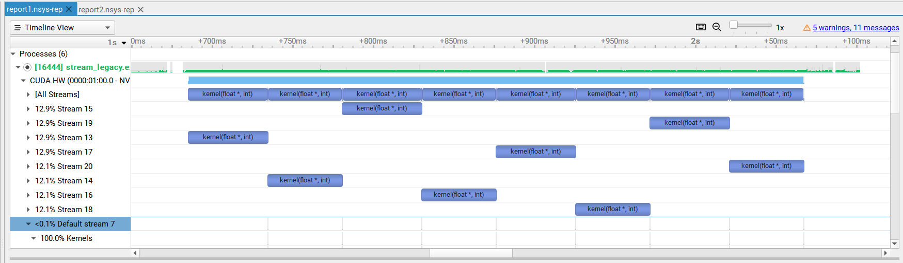
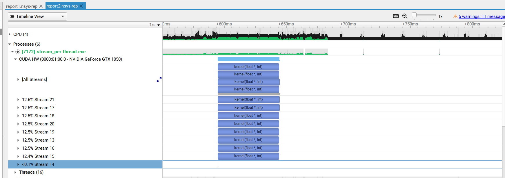

# CUDA 7 流简化并发

异构计算是指有效地使用系统中的所有处理器，包括 CPU 和 GPU。 为此，应用程序必须在多个处理器上同时执行功能。 CUDA 应用程序通过在 流 （按顺序执行的命令序列）中执行异步命令来管理并发性。 不同的流可以同时执行它们的命令，也可以彼此乱序执行它们的命令。 [有关示例，请参阅文章 [如何在 CUDA C/C++ 中重叠数据传输](https://developer.nvidia.com/blog/parallelforall/how-overlap-data-transfers-cuda-cc/) ]

当您执行异步 CUDA 命令而不指定流时，运行时将使用默认流。 在 CUDA 7 之前，默认流是一种特殊流，它隐式地与设备上的所有其他流同步。

[CUDA 7 引入了大量强大的新功能](https://developer.nvidia.com/blog/parallelforall/cuda-7-release-candidate-feature-overview/) ，包括为每个主机线程使用独立默认流的新选项，这避免了旧默认流的序列化。 在这篇文章中，我将向您展示这如何简化在 CUDA 程序中实现内核和数据副本之间的并发性。

## CUDA 中的异步命令

如 CUDA C 编程指南所述，异步命令在设备完成请求的任务之前将控制权返回给调用主机线程（它们是非阻塞的）。 这些命令是：

- 内核启动；
- 两个地址之间的内存复制到同一设备内存；
- 将 64 KB 或更小的内存块从主机复制到设备；
- 由函数执行的内存复制 Async后缀;
- 内存设置函数调用。

为内核启动或主机设备内存复制指定流是可选的； 您可以在不指定流（或通过将流参数设置为零）的情况下调用 CUDA 命令。 以下两行代码都在默认流上启动内核。 

```c++
kernel<<< blocks, threads, bytes >>>();    // default stream
kernel<<< blocks, threads, bytes, 0 >>>(); // stream 0
```

## 默认流

当并发性对性能并不重要时，默认流非常有用。 在 CUDA 7 之前，每个设备都有一个用于所有主机线程的默认流，这会导致隐式同步。 正如 CUDA C 编程指南中的“隐式同步”部分所述，如果主机线程向来自不同流的两个命令之间的默认流发出任何 CUDA 命令，则它们不能同时运行。 

CUDA 7 引入了一个新选项，即 每线程默认流 ，它有两个作用。 首先，它为每个主机线程提供自己的默认流。 这意味着不同主机线程向默认流发出的命令可以同时运行。 其次，这些默认流是常规流。 这意味着默认流中的命令可以与非默认流中的命令同时运行。 

要在 CUDA 7 及更高版本中启用每线程默认流，您可以使用 nvcc命令行选项 --default-stream per-thread， 或者 #define这 CUDA_API_PER_THREAD_DEFAULT_STREAM包含 CUDA 标头之前的预处理器宏 (cuda.h或者 cuda_runtime.h) 。 重要的是要注意：您不能使用 #define CUDA_API_PER_THREAD_DEFAULT_STREAM编译代码时在 .cu 文件中启用此行为 nvcc因为 nvcc隐含地包括 cuda_runtime.h在翻译单元的顶部。

## 多流示例 

让我们看一个简单的例子。 以下代码只是在八个流上启动一个简单内核的八个副本。 我们只为每个网格启动一个线程块，因此有足够的资源来同时运行多个网格。 作为传统默认流如何导致序列化的示例，我们在默认流上添加了不起作用的虚拟内核启动。 这是代码。 

```c
const int N = 1 << 20;

__global__ void kernel(float *x, int n)
{
    int tid = threadIdx.x + blockIdx.x * blockDim.x;
    for (int i = tid; i < n; i += blockDim.x * gridDim.x) {
        x[i] = sqrt(pow(3.14159,i));
    }
}

int main()
{
    const int num_streams = 8;

    cudaStream_t streams[num_streams];
    float *data[num_streams];

    for (int i = 0; i < num_streams; i++) {
        cudaStreamCreate(&streams[i]);
 
        cudaMalloc(&data[i], N * sizeof(float));
        
        // launch one worker kernel per stream
        kernel<<<1, 64, 0, streams[i]>>>(data[i], N);

        // launch a dummy kernel on the default stream
        kernel<<<1, 1>>>(0, 0);
    }

    cudaDeviceReset();

    return 0;
}
```

[NVIDIA Visual Profiler Profiler User’s Guide](https://docs.nvidia.com/cuda/profiler-users-guide/index.html)

请注意，Visual Profiler 和 nvprof 将在未来的 CUDA 版本中弃用。 NVIDIA Volta 平台是完全支持这些工具的最后一个架构。 建议使用下一代工具 NVIDIA Nsight Systems 进行 GPU 和 CPU 采样和跟踪，并使用 NVIDIA Nsight Compute 进行 GPU 内核分析。 

请参阅 [从 Visual Profiler 和 nvprof 迁移到 Nsight 工具部分](https://docs.nvidia.com/cuda/profiler-users-guide/index.html#migrating-to-nsight-tools-from-visual-profiler-and-nvprof)。 有关更多详细信息

首先，让我们通过不带任何选项的编译来检查遗留行为。 

```
nvcc ./Stream_test.cu -o stream_legacy 
```

您可以看到默认流上虚拟内核的非常小的条，以及它们如何导致所有其他流序列化。 



现在让我们尝试新的每线程默认流。 

```
nvcc --default-stream per-thread ./Stream_test.cu -o stream_per-thread
```

在这里，您可以看到九个流之间的完全并发性：默认流（在本例中映射到流 14）以及我们创建的其他八个流。 请注意，虚拟内核运行得如此之快，以至于很难看到此图像中默认流上有八个调用。 




