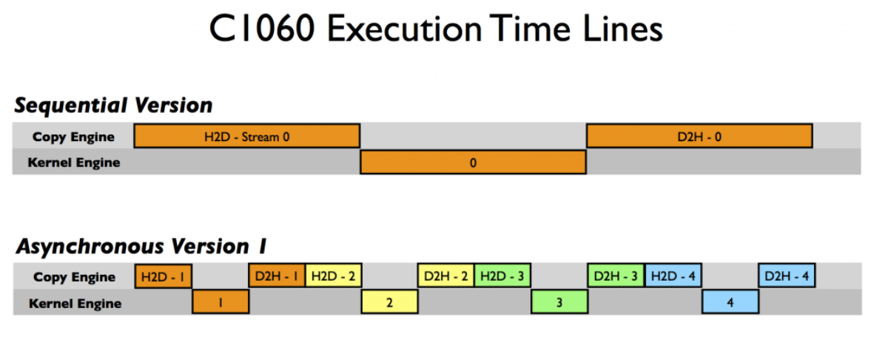
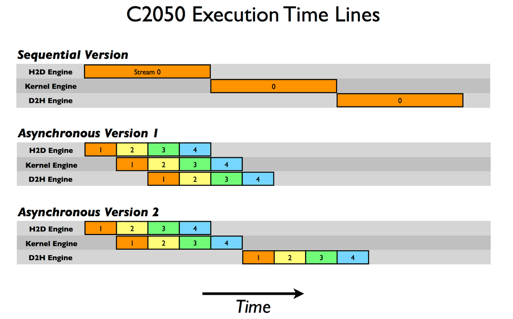

# 如何在 CUDA C/C++ 中重叠数据传输

在 上一篇 [CUDA C/C++ 文章](https://developer.nvidia.com/blog/parallelforall/how-optimize-data-transfers-cuda-cc/) 中，我们讨论了如何在主机和设备之间有效地传输数据。 

在这篇文章中，我们讨论如何将数据传输与主机上的计算、设备上的计算以及在某些情况下主机和设备之间的其他数据传输重叠。 实现数据传输和其他操作之间的重叠需要使用 CUDA 流，因此首先让我们了解一下流。

## CUDA 流

是 CUDA 中的流 按照主机代码发出的顺序在设备上执行的一系列操作。 虽然流中的操作保证按规定的顺序执行，但不同流中的操作可以交错，并且在可能的情况下，它们甚至可以同时运行。

### 默认流

CUDA 中的所有设备操作（内核和数据传输）都在流中运行。 当未指定流时，将使用默认流（也称为“空流”）。 默认流与其他流不同，因为它是与设备上的操作相关的同步流： 在设备上任何流中 之前发出的所有操作都完成之前，默认流中的操作不会开始，并且默认流中的操作也 将开始。流必须在任何其他操作（在设备上的任何流中）开始之前完成。

请注意，2015 年发布的 CUDA 7 引入了一个新选项，可以为每个主机线程使用单独的默认流，并将每个线程默认流视为常规流（即它们不与其他流中的操作同步）。 中了解有关此新行为的更多信息 [在GPU 专业提示：CUDA 7 Streams 简化并发](https://developer.nvidia.com/blog/parallelforall/gpu-pro-tip-cuda-7-streams-simplify-concurrency/) 。

让我们看一些使用默认流的简单代码示例，并从主机和设备的角度讨论操作如何进行。 

```c
cudaMemcpy(d_a, a, numBytes, cudaMemcpyHostToDevice);
increment<<<1,N>>>(d_a)
cudaMemcpy(a, d_a, numBytes, cudaMemcpyDeviceToHost);
```

在上面的代码中，从设备的角度来看，所有三个操作都发出到同一（默认）流，并将按照发出的顺序执行。

从主机的角度来看，隐式数据传输是阻塞或同步传输，而内核启动是异步的。 由于第一行的主机到设备的数据传输是同步的，因此在主机到设备的传输完成之前，CPU 线程不会到达第二行的内核调用。 一旦内核发出，CPU线程就会移动到第三行，但由于设备端的执行顺序，该行上的传输无法开始。

**从主机的角度来看，内核启动的异步行为使得重叠设备和主机计算变得非常简单**。 我们可以修改代码来添加一些独立的CPU计算，如下所示。 

```c
cudaMemcpy(d_a, a, numBytes, cudaMemcpyHostToDevice);
increment<<<1,N>>>(d_a)
myCpuFunction(b)
cudaMemcpy(a, d_a, numBytes, cudaMemcpyDeviceToHost);
```

在上面的代码中，只要 increment()内核在 CPU 线程执行的设备上启动 myCpuFunction()，将 CPU 上的执行与 GPU 上的内核执行重叠。 无论是主机函数还是设备内核先完成，都不会影响后续的设备到主机的传输，该传输仅在内核完成后才开始。 从设备的角度来看，与前面的示例相比没有任何变化； 设备完全不知道 myCpuFunction().

### 非默认流

CUDA C/C++ 中的非默认流在主机代码中声明、创建和销毁，如下所示。 

```c
cudaStream_t stream1;
cudaError_t result;
result = cudaStreamCreate(&stream1)
result = cudaStreamDestroy(stream1)
```

要向非默认流发出数据传输，我们使用 cudaMemcpyAsync()函数，类似于 cudaMemcpy()上一篇文章中讨论的函数，但将流标识符作为第五个参数。 

```c
result = cudaMemcpyAsync(d_a, a, N, cudaMemcpyHostToDevice, stream1)
```

cudaMemcpyAsync()在主机上是非阻塞的，因此控制权在发出传输后立即返回到主机线程。 有 [cudaMemcpy2DAsync()](https://docs.nvidia.com/cuda/cuda-runtime-api/index.html#group__CUDART__MEMORY_1g7f182f1a8b8750c7fa9e18aeb280d31c)和 [cudaMemcpy3DAsync()](https://docs.nvidia.com/cuda/cuda-runtime-api/index.html#group__CUDART__MEMORY_1gb5854dd48800fe861864ae8784762a46)该例程的变体，可以在指定的流中异步传输 2D 和 3D 数组部分。 

为了将内核发布到非默认流，我们将流标识符指定为第四个执行配置参数（第三个执行配置参数分配共享设备内存，我们将在稍后讨论；现在使用 0）。

```c
increment<<<1,N,0,stream1>>>(d_a)
```

### 与流同步

由于非默认流中的所有操作相对于主机代码都是非阻塞的，因此您将遇到需要将主机代码与流中的操作同步的情况。 做这件事有很多种方法。 “重锤”的方式是使用 [cudaDeviceSynchronize()](https://docs.nvidia.com/cuda/cuda-runtime-api/index.html#group__CUDART__DEVICE_1g32bdc6229081137acd3cba5da2897779)，它会阻止主机代码，直到设备上所有先前发出的操作完成为止。 在大多数情况下，这是过度的，并且由于停顿整个设备和主机线程而确实会损害性能。

CUDA 流 API 有多种不太严格的方法将主机与流同步。 功能 [cudaStreamSynchronize(stream)](https://docs.nvidia.com/cuda/cuda-runtime-api/index.html#group__CUDART__STREAM_1geb3b2f88b7c1cff8b67a998a3a41c179)可用于阻塞主机线程，直到指定流中所有先前发出的操作完成。 功能 [cudaStreamQuery(stream)](https://docs.nvidia.com/cuda/cuda-runtime-api/index.html#group__CUDART__STREAM_1ge78feba9080b59fe0fff536a42c13e6d)测试发送到指定流的所有操作是否已完成，而不阻止主机执行。 功能 [cudaEventSynchronize(event)](https://docs.nvidia.com/cuda/cuda-runtime-api/index.html#group__CUDART__EVENT_1g08241bcf5c5cb686b1882a8492f1e2d9)和 [cudaEventQuery(event)](https://docs.nvidia.com/cuda/cuda-runtime-api/index.html#group__CUDART__EVENT_1gf8e4ddb569b1da032c060f0c54da698f)其行为类似于它们的流对应项，不同之处在于它们的结果基于是否已记录指定的事件而不是指定的流是否空闲。 (event)同步单个流中特定事件的操作 您还可以使用[cudaStreamWaitEvent](https://docs.nvidia.com/cuda/cuda-runtime-api/index.html#group__CUDART__STREAM_1g80c62c379f0c3ed8afe31fd0a31ad8a2) （即使该事件记录在不同的流中或不同的设备上！）。 


## 重叠的内核执行和数据传输

前面我们演示了如何将默认流中的内核执行与主机上的代码执行重叠。 但我们在这篇文章中的主要目标是向您展示如何将内核执行与数据传输重叠。 要实现这一点有几个要求。

- 该设备必须能够“并发复制和执行”。 这可以从以下位置查询 deviceOverlap的领域 cudaDeviceProp结构体，或从输出 deviceQueryCUDA SDK/工具包中包含的示例。 几乎所有具有计算能力 1.1 及更高版本的设备都具有此功能。
- 内核执行和要重叠的数据传输必须都发生在 **不同的非默认流**中。
- 数据传输涉及的主机内存必须是 [固定](https://developer.nvidia.com/blog/how-optimize-data-transfers-cuda-cc/) 内存。 

因此，让我们修改上面的简单主机代码以使用多个流，看看是否可以实现任何重叠。 此示例的完整代码可 在 Github 上找到 。 在修改后的代码中，我们分解了 size 数组 N分成大块 streamSize元素。 由于内核对所有元素独立操作，因此每个块都可以独立处理。 使用的（非默认）流的数量是 nStreams=N/streamSize。 有多种方式实现数据的领域分解和处理； 一种是循环遍历数组每个块的所有操作，如本示例代码所示。 

```c
for (int i = 0; i < nStreams; ++i) {
  int offset = i * streamSize;
  cudaMemcpyAsync(&d_a[offset], &a[offset], streamBytes, cudaMemcpyHostToDevice, stream[i]);
  kernel<<<streamSize/blockSize, blockSize, 0, stream[i]>>>(d_a, offset);
  cudaMemcpyAsync(&a[offset], &d_a[offset], streamBytes, cudaMemcpyDeviceToHost, stream[i]);
}
```

另一种方法是将类似的操作一起批处理，首先发出所有主机到设备的传输，然后是所有内核启动，然后是所有设备到主机的传输，如以下代码所示。

```c
for (int i = 0; i < nStreams; ++i) {
  int offset = i * streamSize;
  cudaMemcpyAsync(&d_a[offset], &a[offset], 
                  streamBytes, cudaMemcpyHostToDevice, cudaMemcpyHostToDevice, stream[i]);
}

for (int i = 0; i < nStreams; ++i) {
  int offset = i * streamSize;
  kernel<<<streamSize/blockSize, blockSize, 0, stream[i]>>>(d_a, offset);
}

for (int i = 0; i < nStreams; ++i) {
  int offset = i * streamSize;
  cudaMemcpyAsync(&a[offset], &d_a[offset], 
                  streamBytes, cudaMemcpyDeviceToHost, cudaMemcpyDeviceToHost, stream[i]);
}
```
上面显示的两种异步方法都会产生正确的结果，并且在这两种情况下，相关操作都会按照需要执行的顺序向同一流发出。 但这两种方法的性能差异很大，具体取决于所使用的特定 GPU

在 Tesla C1060（计算能力 1.3）上运行[测试代码](https://github.com/NVIDIA-developer-blog/code-samples/blob/master/series/cuda-cpp/overlap-data-transfers/async.cu)（来自 Github）给出以下结果。 

```
Device : Tesla C1060

Time for sequential transfer and execute (ms ): 12.92381
  max error : 2.3841858E -07
Time for asynchronous V1 transfer and execute (ms ): 13.63690 
  max error : 2.3841858E -07
Time for asynchronous V2 transfer and execute (ms ): 8.84588
  max error : 2.3841858E -07
```

Tesla C2050
```
Device : Tesla C2050

Time for sequential transfer and execute (ms ): 9.984512
  max error : 1.1920929e -07
Time for asynchronous V1 transfer and execute (ms ): 5.735584 
  max error : 1.1920929e -07
Time for asynchronous V2 transfer and execute (ms ): 7.597984
  max error : 1.1920929e -07
```

1050:
```
Device : NVIDIA GeForce GTX 1050
Time for sequential transfer and execute (ms): 27.721952
  max error: 1.192093e-07
Time for asynchronous V1 transfer and execute (ms): 22.275072
  max error: 1.192093e-07
Time for asynchronous V2 transfer and execute (ms): 22.723583
  max error: 1.192093e-07
```

4090
```
Device : NVIDIA GeForce RTX 4090
Time for sequential transfer and execute (ms): 2.096128
  max error: 1.192093e-07
Time for asynchronous V1 transfer and execute (ms): 1.786880
  max error: 1.192093e-07
Time for asynchronous V2 transfer and execute (ms): 1.742848
  max error: 1.192093e-07
```

我们将使用阻塞传输的顺序传输和内核执行其用作异步加速比较的基准。 为什么两种异步策略在不同的架构上表现不同？ 为了解读这些结果，我们需要更多地了解 CUDA 设备如何调度和执行任务。 CUDA 设备包含用于各种任务的引擎，这些引擎在发出操作时将其排队。 不同引擎中的任务之间的依赖关系得到维护，但在任何引擎内，所有外部依赖关系都会丢失； 每个引擎队列中的任务按照它们发出的顺序执行。 C1060 有一个复制引擎和一个内核引擎。 下图显示了在 C1060 上执行示例代码的时间线。 



在原理图中，我们假设主机到设备传输、内核执行和设备到主机传输所需的时间大致相同（选择内核代码是为了实现这一点）。 正如顺序内核所预期的那样，任何操作都没有重叠。 对于我们代码的第一个异步版本，复制引擎中的执行顺序是：H2D 流(1)、D2H 流(1)、H2D 流(2)、D2H 流(2)，依此类推。 这就是为什么我们在 C1060 上使用第一个异步版本时没有看到任何加速：任务按照排除内核执行和数据传输重叠的顺序发送到复制引擎。 然而，对于版本二，所有主机到设备的传输都是在任何设备到主机的传输之前发出的，如较低的执行时间所示，重叠是可能的。 从我们的示意图中，我们预计异步版本 2 的执行时间是顺序版本的 8/12，即 8.7 毫秒，这在前面给出的计时结果中得到了证实。

在 C2050 上，两个功能相互作用导致行为与 C1060 不同。 C2050 有两个复制引擎，一个用于主机到设备的传输，另一个用于设备到主机的传输，以及一个内核引擎。 下图说明了我们的示例在 C2050 上的执行情况。 



拥有两个复制引擎解释了为什么异步版本 1 在 C2050 上实现了良好的加速：stream[i] 中数据的设备到主机传输不会阻止stream[i+1 中数据的主机到设备传输] 就像在 C1060 上一样，因为 C2050 上的每个复制方向都有一个单独的引擎。 该原理图预测执行时间相对于顺序版本将减少一半，这大致就是我们的计时结果所显示的。

但是，在 C2050 上的异步版本 2 中观察到的性能下降又如何呢？ 这与C2050能够并发运行多个内核有关。 当在不同（非默认）流中连续发出多个内核时，调度程序会尝试启用这些内核的并发执行，从而延迟通常在每个内核完成后发生的信号（负责启动设备到主机的传输）直到所有内核完成。 因此，虽然在异步代码的第二个版本中主机到设备的传输和内核执行之间存在重叠，但内核执行和设备到主机的传输之间没有重叠。 该原理图预测异步版本 2 的总时间是串行版本时间的 9/12，即 7.5 毫秒，我们的计时结果证实了这一点。

本文中使用的示例的更详细描述可在 CUDA Fortran 异步数据传输 中找到。 好消息是，对于计算能力为 3.5 的设备（K20 系列），Hyper-Q 功能无需定制启动顺序，因此上述任一方法都可以使用。 我们将在以后的文章中讨论如何使用 Kepler 功能，但现在，以下是在 Tesla K20c GPU 上运行示例代码的结果。 正如您所看到的，两种异步方法都比同步代码实现了相同的加速。 

```c
Device : Tesla K20c
Time for sequential transfer and execute (ms): 7.101760
  max error : 1.1920929e -07
Time for asynchronous V1 transfer and execute (ms): 3.974144 
  max error : 1.1920929e -07
Time for asynchronous V2 transfer and execute (ms): 3.967616 
  max error : 1.1920929e -07
```

完整代码：
```c
/* Copyright (c) 1993-2015, NVIDIA CORPORATION. All rights reserved.
 *
 * Redistribution and use in source and binary forms, with or without
 * modification, are permitted provided that the following conditions
 * are met:
 *  * Redistributions of source code must retain the above copyright
 *    notice, this list of conditions and the following disclaimer.
 *  * Redistributions in binary form must reproduce the above copyright
 *    notice, this list of conditions and the following disclaimer in the
 *    documentation and/or other materials provided with the distribution.
 *  * Neither the name of NVIDIA CORPORATION nor the names of its
 *    contributors may be used to endorse or promote products derived
 *    from this software without specific prior written permission.
 *
 * THIS SOFTWARE IS PROVIDED BY THE COPYRIGHT HOLDERS ``AS IS'' AND ANY
 * EXPRESS OR IMPLIED WARRANTIES, INCLUDING, BUT NOT LIMITED TO, THE
 * IMPLIED WARRANTIES OF MERCHANTABILITY AND FITNESS FOR A PARTICULAR
 * PURPOSE ARE DISCLAIMED.  IN NO EVENT SHALL THE COPYRIGHT OWNER OR
 * CONTRIBUTORS BE LIABLE FOR ANY DIRECT, INDIRECT, INCIDENTAL, SPECIAL,
 * EXEMPLARY, OR CONSEQUENTIAL DAMAGES (INCLUDING, BUT NOT LIMITED TO,
 * PROCUREMENT OF SUBSTITUTE GOODS OR SERVICES; LOSS OF USE, DATA, OR
 * PROFITS; OR BUSINESS INTERRUPTION) HOWEVER CAUSED AND ON ANY THEORY
 * OF LIABILITY, WHETHER IN CONTRACT, STRICT LIABILITY, OR TORT
 * (INCLUDING NEGLIGENCE OR OTHERWISE) ARISING IN ANY WAY OUT OF THE USE
 * OF THIS SOFTWARE, EVEN IF ADVISED OF THE POSSIBILITY OF SUCH DAMAGE.
 */

#include <stdio.h>

// Convenience function for checking CUDA runtime API results
// can be wrapped around any runtime API call. No-op in release builds.
inline
cudaError_t checkCuda(cudaError_t result)
{
#if defined(DEBUG) || defined(_DEBUG)
  if (result != cudaSuccess) {
    fprintf(stderr, "CUDA Runtime Error: %s\n", cudaGetErrorString(result));
    assert(result == cudaSuccess);
  }
#endif
  return result;
}

__global__ void kernel(float *a, int offset)
{
  int i = offset + threadIdx.x + blockIdx.x*blockDim.x;
  float x = (float)i;
  float s = sinf(x); 
  float c = cosf(x);
  a[i] = a[i] + sqrtf(s*s+c*c);
}

float maxError(float *a, int n) 
{
  float maxE = 0;
  for (int i = 0; i < n; i++) {
    float error = fabs(a[i]-1.0f);
    if (error > maxE) maxE = error;
  }
  return maxE;
}

int main(int argc, char **argv)
{
  const int blockSize = 256, nStreams = 4;
  const int n = 4 * 1024 * blockSize * nStreams;
  const int streamSize = n / nStreams;
  const int streamBytes = streamSize * sizeof(float);
  const int bytes = n * sizeof(float);
   
  int devId = 0;
  if (argc > 1) devId = atoi(argv[1]);

  cudaDeviceProp prop;
  checkCuda( cudaGetDeviceProperties(&prop, devId));
  printf("Device : %s\n", prop.name);
  checkCuda( cudaSetDevice(devId) );
  
  // allocate pinned host memory and device memory
  float *a, *d_a;
  checkCuda( cudaMallocHost((void**)&a, bytes) );      // host pinned
  checkCuda( cudaMalloc((void**)&d_a, bytes) ); // device

  float ms; // elapsed time in milliseconds
  
  // create events and streams
  cudaEvent_t startEvent, stopEvent, dummyEvent;
  cudaStream_t stream[nStreams];
  checkCuda( cudaEventCreate(&startEvent) );
  checkCuda( cudaEventCreate(&stopEvent) );
  checkCuda( cudaEventCreate(&dummyEvent) );
  for (int i = 0; i < nStreams; ++i)
    checkCuda( cudaStreamCreate(&stream[i]) );
  
  // baseline case - sequential transfer and execute
  memset(a, 0, bytes);
  checkCuda( cudaEventRecord(startEvent,0) );
  checkCuda( cudaMemcpy(d_a, a, bytes, cudaMemcpyHostToDevice) );
  kernel<<<n/blockSize, blockSize>>>(d_a, 0);
  checkCuda( cudaMemcpy(a, d_a, bytes, cudaMemcpyDeviceToHost) );
  checkCuda( cudaEventRecord(stopEvent, 0) );
  checkCuda( cudaEventSynchronize(stopEvent) );
  checkCuda( cudaEventElapsedTime(&ms, startEvent, stopEvent) );
  printf("Time for sequential transfer and execute (ms): %f\n", ms);
  printf("  max error: %e\n", maxError(a, n));

  // asynchronous version 1: loop over {copy, kernel, copy}
  memset(a, 0, bytes);
  checkCuda( cudaEventRecord(startEvent,0) );
  for (int i = 0; i < nStreams; ++i) {
    int offset = i * streamSize;
    checkCuda( cudaMemcpyAsync(&d_a[offset], &a[offset], 
                               streamBytes, cudaMemcpyHostToDevice, 
                               stream[i]) );
    kernel<<<streamSize/blockSize, blockSize, 0, stream[i]>>>(d_a, offset);
    checkCuda( cudaMemcpyAsync(&a[offset], &d_a[offset], 
                               streamBytes, cudaMemcpyDeviceToHost,
                               stream[i]) );
  }
  checkCuda( cudaEventRecord(stopEvent, 0) );
  checkCuda( cudaEventSynchronize(stopEvent) );
  checkCuda( cudaEventElapsedTime(&ms, startEvent, stopEvent) );
  printf("Time for asynchronous V1 transfer and execute (ms): %f\n", ms);
  printf("  max error: %e\n", maxError(a, n));

  // asynchronous version 2: 
  // loop over copy, loop over kernel, loop over copy
  memset(a, 0, bytes);
  checkCuda( cudaEventRecord(startEvent,0) );
  for (int i = 0; i < nStreams; ++i)
  {
    int offset = i * streamSize;
    checkCuda( cudaMemcpyAsync(&d_a[offset], &a[offset], 
                               streamBytes, cudaMemcpyHostToDevice,
                               stream[i]) );
  }
  for (int i = 0; i < nStreams; ++i)
  {
    int offset = i * streamSize;
    kernel<<<streamSize/blockSize, blockSize, 0, stream[i]>>>(d_a, offset);
  }
  for (int i = 0; i < nStreams; ++i)
  {
    int offset = i * streamSize;
    checkCuda( cudaMemcpyAsync(&a[offset], &d_a[offset], 
                               streamBytes, cudaMemcpyDeviceToHost,
                               stream[i]) );
  }
  checkCuda( cudaEventRecord(stopEvent, 0) );
  checkCuda( cudaEventSynchronize(stopEvent) );
  checkCuda( cudaEventElapsedTime(&ms, startEvent, stopEvent) );
  printf("Time for asynchronous V2 transfer and execute (ms): %f\n", ms);
  printf("  max error: %e\n", maxError(a, n));

  // cleanup
  checkCuda( cudaEventDestroy(startEvent) );
  checkCuda( cudaEventDestroy(stopEvent) );
  checkCuda( cudaEventDestroy(dummyEvent) );
  for (int i = 0; i < nStreams; ++i)
    checkCuda( cudaStreamDestroy(stream[i]) );
  cudaFree(d_a);
  cudaFreeHost(a);

  return 0;
}
```

## 总结

这篇文章和 上一篇文章 讨论了如何优化主机和设备之间的数据传输。 上一篇文章重点介绍了如何最大限度地减少执行此类传输的时间，这篇文章介绍了流以及如何使用它们通过并发执行副本和内核来屏蔽数据传输时间。

在一篇涉及流的文章中，我应该提到，虽然使用默认流对于开发代码来说很方便，同步代码更简单，但最终您的代码应该使用非默认流或 CUDA 7 对每线程默认流的支持（请阅读 [GPU Pro提示：CUDA 7 Streams 简化了并发性](https://developer.nvidia.com/blog/gpu-pro-tip-cuda-7-streams-simplify-concurrency/) ）。 这在编写库时尤其重要。 如果库中的代码使用默认流，则最终用户就没有机会将数据传输与库内核执行重叠。

现在您知道如何在主机和设备之间有效地移动数据，因此我们将在下 一篇文章 中了解如何从内核内部有效地访问数据。 